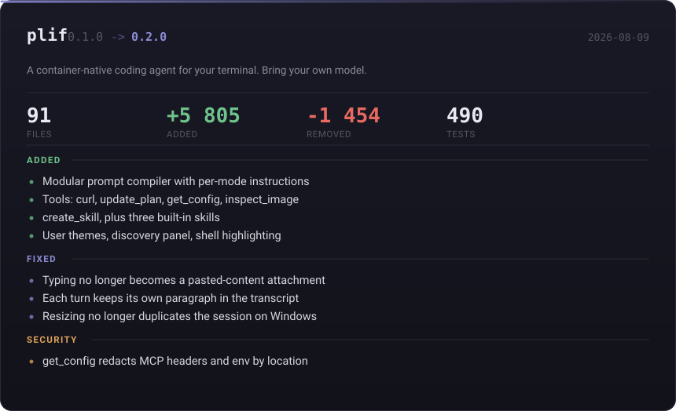

# Changelog

All notable changes to plif. This project follows [Semantic Versioning](https://semver.org/spec/v2.0.0.html).

## [0.4.0] — Unreleased

This release is under development. The following improvements define the
0.4.0 scope and are being implemented together as one cohesive runtime,
installation and session experience.

### Added

- **Code Mode (`toolMode = "code"`).** An opt-in tool presentation in which the
  model receives one tool on the wire, `run_code`, plus a generated TypeScript
  declaration of the whole tool catalogue in the system prompt, and calls tools
  from inside programs it writes. Three savings follow: the schemas move out of
  the per-request payload into the cacheable prompt prefix, only what a program
  logs and returns enters the conversation, and dependent calls collapse from
  one round trip each into one request and one result. `/code-mode` switches it,
  `PLIF_TOOLS_MODE` overrides for a session, and `/token-split stats code-mode`
  reports what the collapse kept off the wire.
- **Process-isolated `run_code` runtime.** Programs run in their own OS process,
  started by the container and confined by the active sandbox backend — the same
  jail every `run_command` goes through. Tool calls made inside a program are
  dispatched back through the host's existing policy engine, path jail and audit
  log, so approvals and denials behave exactly as they do natively. The earlier
  fail-closed refusal is retained for any caller with no container to run in.
  The runtime treats the program as a hostile peer: inbound frames are rebuilt
  from own properties, call ids are answered at most once, and non-lossless JSON
  is refused rather than coerced.
- **Independent wall and compute budgets for programs.** `timeoutMs` bounds the
  whole run including time spent in tools; `computeMs` bounds measured busy time
  inside the runtime process, so a program waiting on a slow tool is not killed
  for a hot loop it is not running. Failures come back as a result naming the
  cause — `exception`, `timeout`, `abort`, `process-exit`, `invalid-output`,
  `output-limit`, `call-limit` — with everything logged before the stop.
- **Ordered concurrency inside a program.** Tool calls a program issues follow
  the same contract the native loop applies to a batch: `parallelSafe` calls
  overlap up to a cap, anything else takes the lane alone, and records commit in
  submission order so the audit log reads in the order the program wrote.
- **`code.dispatch` runtime event.** Each tool call made inside a program is
  emitted for the timeline and the audit log without entering the model's
  context, and updates the program's own row rather than opening one per call.

### Planned

- **NPM-first installation and updates.** `npm install -g @plif/cli@latest`
  remains the primary installation path. Windows also gets a guided
  PowerShell installer, and Linux gets a Bash installer with matching
  preflight and post-install behavior.
- **Isolated cross-platform updater.** PLIF gains a standalone updater built
  in pure Rust for Windows and Linux. It is isolated from the main CLI, does
  not require a C# DLL, and is responsible only for safely applying an
  approved update and restarting PLIF when appropriate.
- **Runtime NPM update notifications.** While PLIF is running, it checks the
  NPM registry for a newer published `@plif/cli` version. Git is never used as
  the update source. When a new version exists, PLIF displays the matching
  changelog and lets the user update now, postpone the update, or stop asking.
- **Changelog-gated releases.** `CHANGELOG.md` at the project root is the
  canonical release document and is included in the published CLI package.
  A release must contain the target version and its changelog before it can
  be published. The updater reads the changelog from the NPM package before
  installing it, so the user can review what is changing first.
- **Durable complete history.** Conversation history remains append-only and
  preserves user messages, assistant messages, commands, tool calls, tool
  outputs, approvals, questions, failures, interruptions and other agent
  actions. The transcript and resumed sessions reconstruct that canonical
  history instead of silently dropping actions from the interface.
- **Dedicated subagent histories.** Every subagent becomes an independent,
  main-like session with its own ID, event history, transcript and lifecycle.
  Its work is inspectable in a dedicated history view and is never mixed into
  the parent conversation; the parent receives the result and a reference.
- **Stable context forks.** The first subagent request receives an immutable,
  bounded fork of the main chat context at a checkpoint, including the task,
  relevant messages, answers and tool results. The fork is identified in the
  child session as `Forked from ID-UUID`, so the child knows where it came
  from without sharing a live transcript with the parent.
- **Persistent interactive terminals.** The main agent and its isolated
  subagents can keep a terminal process alive, receive its prompts, send input
  and read output across multiple tool calls. Linux uses a PTY and Windows
  uses ConPTY, so interactive commands no longer depend on a one-shot stdin
  buffer.
- **Follow-up turns for existing subagents.** The parent can send another
  instruction to a persisted subagent instead of closing it and spawning a
  replacement. Queued inputs are routed to the correct isolated session and
  delivered with the next tool-call batch at a safe turn boundary.
- **Scoped persistent memory.** PLIF adds a real SQLite-backed memory store
  with two scopes: persistent global memory for information that should be
  available in every session, and folder memory tied to the canonical active
  workspace. Folder memory is shared by sessions opened in that folder and is
  not loaded when PLIF starts in another folder.
- **Intentional memory writes.** The agent gets one lightweight `remember`
  tool and decides what is worth retaining instead of automatically saving
  the entire conversation. Memory scope remains explicit so global facts do
  not accidentally leak from a workspace.
- **Read-only memory for subagents.** Isolated subagents can read and use the
  global and active-folder memory that applies to their fork, but cannot write,
  change or delete memories. Memory writes remain controlled by the main
  agent.
- **Secret detection before send.** The composer detects token-like values
  beginning with `sk_` locally before they reach a model provider. PLIF shows
  an English warning that directs the user to `/env`, where the secret can be
  stored outside the conversation for the agent to use without exposing its
  value. A second explicit confirmation is required before a user can send
  the secret anyway. The final warning can save a redacted copy of the prompt
  and cancel, optionally copying only that redacted version to the clipboard;
  the up-arrow input history restores the safe draft after `/env` is used.
  If the user explicitly chooses to send anyway, PLIF proceeds with the
  original prompt and its normal persistence behavior.
- **Defense-in-depth credential policy.** Harness instructions treat secrets
  pasted into chat as compromised and forbid the agent from using, repeating
  or forwarding them, including for shell, database, SSH, cloud or privileged
  commands. The agent directs the user to `/env` for approved secret access;
  even after `Send Anyway`, it refuses to use the exposed value and tells the
  user to revoke or rotate it because the provider may have received it.
- **Accurate model identity.** Runtime provider and model metadata is included
  in the harness context. When asked what model is running, PLIF identifies
  the actual provider and model instead of claiming that PLIF itself is the
  model; if metadata is unavailable, it says so without inventing an answer.
- **Bootstrap environment secrets.** Values managed through `/env` are loaded
  into PLIF's controlled runtime environment during startup, making them
  available to the commands and providers that need them without placing
  their values in the model context, prompts, transcript or status output.
- **Project-isolated environment.** `/env` data is scoped to the active project
  boundary and is never inherited by a session opened in another project.
- **OS-backed environment storage.** Windows uses Windows Credential Manager
  and Linux uses Secret Service by default for `/env` values. The project
  boundary remains part of the storage key, so credentials from one project
  cannot be loaded by another. If the native backend is unavailable, PLIF
  falls back to an encrypted local store with an explicit reduced-protection
  warning; plaintext storage is never used. The fallback is unlocked with a
  user-provided passphrase that is never persisted; one local vault passphrase
  can unlock project-separated records without merging their values.
- **Local writing assistance.** An optional CPU-based contextual predictor learns
  word transitions from recent prompts and project vocabulary without sending
  draft text to a remote service. The best completion is painted as ghost text
  inside the input and Tab accepts it; Enter always submits the draft and
  nothing is autocorrected.
- **Expanded emoji completion.** The existing lightweight shortcode menu gains
  a broader catalogue and aliases while preserving `:name:` input, keyboard
  navigation and `Tab` insertion. Selected emojis are expanded into ordinary
  Unicode text before submission; they are sent to the model as text, never as
  file attachments.

The current development baseline below remains part of this unreleased
0.4.0 cycle.

This branch consolidates the reliability and workspace-flow fixes prepared
after 0.3.9. It is not a versioned release yet.

### Added

- **Full-screen `/usage`, `/agents` and `/sessions`.** The three list commands
  are now screens rather than menus that print a line into the transcript.
  `/usage` answers both halves of the question on one surface — context window,
  this session's tokens, requests, turns and tool calls, and the provider's
  limit windows with consumption meters. `/agents` lists every named subagent
  with the model it thinks with and what it is for. `/sessions` shows the
  conversations in this workspace with age and turn count, and resumes the
  selected one with Enter. All three filter as you type and share one frame.
- **Shared screen chrome.** `ScreenFrame` gives every full-screen view the same
  title rail, badge, body and key bar, so status, config, usage, agents and
  sessions read as one tool instead of five.
- **The effort scale is drawn as a scale.** `/effort` lays the cold levels out
  left to right, shallow to deep, with the marks growing and a ramp filling
  beneath them; PLIF sits below a rule because it is a different mode, not a
  deeper one. Left and right arrows move along it. Terminals too narrow to hold
  eight labelled columns keep the previous list.
- **Word-wise editing in the composer.** Ctrl+Left/Right (and Alt, which is
  what a Mac terminal sends) move by word, Ctrl+Backspace and Ctrl+Delete
  remove a word, and Home/End go to the ends of the current line. None of these
  were bound before; they did nothing.
- **`dev/screens-check.mts`.** Renders the screens and tool rows directly
  against fixtures, since `dev/preview.mts` needs a configured provider and a
  live session before it will show them.
- **Durable provider conversation state.** PLIF now keeps a scoped,
  non-secret continuation pointer per session, provider, model, endpoint and
  account instead of confusing local message or database IDs with provider
  state.
- **Native Codex continuation.** Codex sessions use a persistent app-server
  thread with `thread/start`, `thread/resume` and `turn/start`; after a
  restart, PLIF resumes the thread when it is still valid.
- **Safe replay fallback and observability.** If native continuation is
  unavailable or expired, PLIF starts a fresh thread and replays the canonical
  JSONL history. Conversation metrics now record message count, payload size,
  token/cache usage, latency and stable fallback reasons.
- **Configurable continuation policy.** `conversationState = "auto"` is the
  default, with explicit `"native"` and `"replay"` modes available through
  `config.toml` or `PLIF_CONVERSATION_STATE`. See
  [`docs/conversation-state.md`](docs/conversation-state.md).

### Fixed

- **The prompt vanished the moment a session was opened from `/sessions`.**
  Resuming replaces the transcript with a shorter one, and the timeline's
  follow state kept the scroll high-water mark of the transcript that had just
  been closed. Against a mark it could never reach, the fresh session reported
  itself as scrolled away from a tail it had never had, which raised the
  "new below" pill. That pill is a sibling of the scroll viewport inside the
  same column, so it added a row on top of the `maxLines` the layout had
  budgeted for history — and in a panel clamped to the window height, one row
  over the budget is paid for by the last child, which is the prompt. The input
  line was not hidden or unfocused: it had been pushed past the bottom edge of
  the frame. The mark is now dropped whenever the transcript shrinks or empties,
  so a resumed session and a cleared one both open anchored to their own newest
  row, and the pill's row is taken out of the viewport's height instead of out
  of the prompt's.
- **The transcript could not be scrolled, and every attempt cost a full frame.**
  The viewport asserted `scrollTop: Number.MAX_SAFE_INTEGER` on every render.
  Slate clamps to that offset, so a wheel tick moved the view and the render it
  triggered immediately put it back — the position was recomputed, repainted and
  discarded, once per tick, which is why the scrollbar felt both stuck and slow.
  Pinning is a claim about the tail, so it is now made only while the view is at
  the tail; once the reader moves up, the offset is theirs, and `useTailFollow`
  re-pins the moment they return to the newest row. The guarantee the
  unconditional pin was protecting — never stranding a viewport on empty space
  above a loaded transcript — is kept by the high-water reset above rather than
  by overruling the reader.
- **Five test files had never run.** The runner's globs matched `*.test.ts` and
  nothing else, so every `.test.tsx` in `packages/cli/test` — the render tests
  for the timeline, the animation clock, the BTW panel and the timeline window —
  was collected by no run and asserted nothing. The globs now include `.test.tsx`
  and are quoted, so the pattern reaches Node's test runner intact on shells
  that do not expand it. Bringing them back exposed assertions that had drifted
  from the UI they describe: the timeline render test still expected
  `Thinked for: 321 ms` and an `Editing - path (+8 | -2)` summary, neither of
  which the component has emitted for some time. They now assert the labels the
  component actually renders, and the suite runs 1.343 tests with none failing.

- **Dropped animation frames and a shell that froze under a long session.**
  Slate's `segmentGraphemes` built a fresh `Intl.Segmenter` on every call, for
  every text node, on every layout pass of every frame; a CPU profile of an
  almost empty screen put it and the `displayWidth` that calls it at roughly
  40% of process time. With a few hundred transcript rows the frame stopped
  being ready in time and the 120 ms animation clock lost more than half its
  ticks, which is what "the animations do not work" was. `scripts/patch-slate-text.mjs`
  runs from `postinstall` and applies the two behaviour-preserving changes —
  one shared Segmenter, and a fast path for printable ASCII — plus a memoised
  `displayWidth`. At 1200 rows: 7 of 25 frames painted before, 25 of 25 after,
  and mount time 1488 ms to 389 ms. The fix belongs upstream in Slate; the
  script is a no-op once a release carries it.
- **The transcript no longer deletes its own history.** The timeline cut itself
  to the newest 200 entries with no marker, so a long session appeared to lose
  earlier messages. Every row is now rendered and Slate scrolls what does not
  fit. Folds that remain are labelled and say how much is hidden.
- **Bordered boxes with a stretched width painted a three-cell stub.** The
  border rule accepted only a numeric width, so a component asking for `100%` —
  the footer, and latently the Codex login dialog — drew `+-+` and let its
  content spill past the frame and wrap. Width is now resolved against the
  parent during the tree walk.
- **Centred columns left-aligned their own text.** A centred column stretched
  its children to full width, which centres a box but left-aligns the words
  inside a Slate text widget — the startup card's two lines sat against its
  left rail. Text children are now wrapped in a row that centres them.
- **The command menu re-flowed its columns.** Each row sized its own parts, so
  one summary a character too long changed the indent of the command names and
  spilled the last word onto the next line. The columns are fixed-width strings
  the terminal cannot reorganise.
- **The reasoning header cycled all 256 braille patterns.** One pattern per
  tick is not a cycle, it is noise: the mark changed silhouette every frame and
  read as a rendering fault. It uses the shared eight-frame family, and the
  finished state says how long it thought for instead of `Thinked for: 0 ms`.
- **`formatDuration` never rolled over past minutes.** A rate limit resetting
  in four hours read as `239m60s` — both because hours were never carried and
  because rounding 59.6 seconds produced a literal `60s`.
- **A dead step in the middle of every gradient.** `accentStrong` held the
  exact same value as `accentDim`, so the travelling wave visibly stalled a
  third of the way through its ramp.
- **Repeated read commands no longer become false errors.** When the model
  repeats an unchanged, read-only tool call such as `run_command` with the same
  arguments, PLIF reuses the successful result instead of emitting the
  misleading “already called” failure. Real mutations remain protected by the
  repetition guard, and a successful mutation invalidates cached reads.
- Added regression coverage for both unchanged-read replay and replay
  invalidation after a workspace mutation.

### Changed

- **One palette, three families.** The ink moved off a blue lavender
  (`#CDD6F4`) to a near-white with a faint pink-grey bias, so the most-used
  colour on screen belongs to the same family as the identity. The four greys
  were spaced apart — they sat within ten units of each other, which a terminal
  renders as one grey — and made neutral rather than blue. The effort ramp now
  warms from grey toward pink as depth increases, instead of tinting the frame
  away from the accent through blue-greys.
- **File writes read as a sentence, not a framed card.** A write shows
  `Write(path)`, then what it did — "Wrote 140 lines to path", or the added and
  removed counts for an edit — then numbered source lines. Long content folds
  to its first lines behind a labelled `+N lines … Ctrl+E`. The border around
  every write is gone; a session with a dozen file operations was a stack of
  frames carrying no information the indent did not already carry.
- **`/sessions` left the plugin browser.** Resuming a conversation is not an
  extension-management task and no longer opens the browser's fourth tab, next
  to MCP servers and the marketplace catalogue.
- **Known trade — very long sessions.** Rendering the whole transcript costs
  frame rate at the extreme: past roughly 2000 rows the paint loop starts
  dropping ticks again. Not silently deleting the session's history is the
  right side of that trade; culling rows outside the viewport is the actual
  fix and is not done yet.
- **Managed scratch space.** Session files, pasted images, LSP metadata and
  base-image scaffolds now live below `~/.plif/temp` (or the active PLIF store)
  instead of creating loose `plif-*` folders in the operating system Temp
  directory. The container-facing path remains `/temp`.
- **First-run project location.** When PLIF starts outside a detected project,
  it asks for the default projects folder through the normal Ink input and
  persists the choice in `~/.plif/config.toml`; an explicit `-C/--workspace`
  always takes precedence.
- **Frontend preflight.** Web/landing/UI requests can collect a stack and
  visual direction in the same PLIF input before the agent starts, then carry
  those selections as explicit constraints for implementation.
- **Skill policy.** Galileu remains a global review requirement, while
  `plif-cybersecurity` is mandatory specifically in PLIF effort mode.

### Validation

- Core harness tests: **37 passed, 0 failed**.
- Full test suite: **1,229 passed, 0 failed, 0 cancelled, 20 skipped**
  (**1,249 tests discovered**).
- TypeScript check and production build: passed.
- Frame budget, measured with a transcript-shaped tree against the 120 ms
  animation clock: 600 rows **11/25 to 25/25** painted frames, 1200 rows
  **7/25 to 25/25**, mount **1488 ms to 389 ms**.
- Grapheme measurement, 8000 calls over typical terminal rows: **107 ms to
  1.3 ms**.
- Lint: no lint script is defined in the root package.
- `git diff --check`: passed.

## [0.3.9] — 2026-08-24

This release packages the current PLIF runtime and interaction work as a new
artifact. It is the first release after the 0.3.8 npm publication and includes
the complete Codex integration and the pending TUI/engine changes.

### Added

- **Codex provider inside PLIF.** The Codex app-server adapter is now part of
  the provider catalogue, with in-app login/request handling instead of sending
  users to an unrelated external flow.
- **Native inline decisions.** Provider questions and Codex
  `requestUserInput` events return to the active PLIF input as selectable
  choices, so a model can ask for a decision without ending the session and
  waiting for a separate chat turn.
- **Shared permission context.** The active workspace roots, permission mode,
  file-change approvals, command approvals and network approvals are passed
  through one PLIF execution context.
- **Modular command loading.** Interactive commands are split into focused
  modules and loaded through a smaller startup path, while the command surface
  remains compatible.
- **Reusable builtin skill foundation.** DME Spynx skills now include shared
  core-contract and design-language references, plus the DME Spyx component
  picker package and its bridge assets.

### Changed

- **Permission semantics.** Codex follows the same PLIF policy boundary as the
  rest of the harness: auto-approve stays inside the workspace, on-request
  actions return to the PLIF approval UI, and paths outside the workspace are
  denied instead of silently escaping the project.
- **Model/runtime metadata.** Provider and model catalog data, discovery,
  stream handling, protocol metadata and capability details stay attached to
  the selected route instead of being inferred from display names.
- **Session and engine flow.** Goals, subagents, tool expansion, event/state
  propagation, token-split artifacts and session persistence are wired through
  the same runtime lifecycle.
- **Terminal behavior.** Input history, resize handling, focus frames, activity
  surfaces and command navigation were tightened for narrow and wide TTYs
  without changing the public `plif` command.
- **Distribution metadata.** Root and workspace packages, lockfile, README,
  CI release defaults and the Codex client version now consistently identify
  `0.3.9`.

### Fixed

- Codex no longer falls back to an independent read-only permission model when
  PLIF has already granted a scoped workspace policy.
- Model questions no longer terminate a turn as an unselectable prose prompt.
- Internal command extraction no longer requires loading the full interactive
  command implementation on the first startup path.
- Cross-package release metadata no longer points the CLI at stale `0.3.8`
  workspace dependencies.

### Validation

- Windows validation: **1,135 tests passed, 0 failed, 20 platform skips**.
- `npm run typecheck`: passed.
- `npm run build`: passed.
- `npm pack --workspace @plif/cli --dry-run`: passed for `@plif/cli@0.3.9`.
- Node compatibility: local Node.js `24.19.0`; package contract remains
  `Node.js >=20.11`; CI runs Node.js 22 on Windows and Ubuntu.

## [0.3.8] — 2026-08-24

### Added

- **Isolated `/temp` workspace.** Every interactive and one-shot agent session
  now receives a dedicated scratch directory mounted at `/temp`, separate from
  the project mount at `/project`.
- **Visible temp policy.** `/temp` explains the intended split: transient
  artifacts stay disposable, while `/project` is reserved for requested
  deliverables. The command is keyboard-friendly and safe to run while the
  agent is working.
- **Default container coverage.** Containers created by the agent and by
  `/new` inherit the isolated scratch mount. An explicitly supplied `/temp`
  mount remains authoritative instead of being duplicated.

### Security

- Scratch directories are created with the operating system's unique temporary
  directory primitive, validated to remain under the system temp root, and
  cleaned idempotently at session shutdown.
- Cleanup refuses to follow a replaced symlink or remove a path outside the
  session's validated temp boundary.
- The physical host scratch path is not written to the transcript or exposed to
  the model; the model receives only the stable virtual path `/temp`.
- The system prompt now distinguishes `/project` from `/temp` and directs logs,
  screenshots, probes and intermediate output away from the user's repository.
- **Shared Codex permission boundary.** Codex now receives the active PLIF
  workspace root and permission mode instead of using an independent hard-coded
  read-only policy. Commands, file changes and network access return through the
  same PLIF approval broker, while paths outside the active workspace remain
  denied.

### Interaction

- **Inline decisions.** Model questions are routed into the active PLIF input as
  selectable choices instead of ending the turn with a prose clarification.
  Codex app-server `requestUserInput` messages use the same UI and resume the
  current turn after the answer.
- **Node compatibility.** The workspace and all published packages keep the
  `Node.js >=20.11` contract; CI validates with Node.js 22, and the release was
  checked locally on Node.js 24.19.0.

### Validation

- Full Windows validation: **1,135 tests passed, 0 failed, 20 platform skips**.
- Typecheck and targeted `/temp` mount/cleanup tests pass.

## [0.3.6] — 2026-08-22

### Added

- **Provider-backed model discovery.** `/model` now preserves provider, product,
  tier, protocol and stream metadata instead of guessing from model names.
- **OpenCode Go models.** The paid Go catalog is explicit, including the
  Anthropic-compatible Qwen 3.8 Max route and DeepSeek V4 Flash.
- **Protocol-aware content handling.** OpenAI-compatible delta streams,
  snapshot responses and Anthropic message streams are normalized separately,
  with divergence checks for malformed repeated content.

### Changed

- Model configuration now carries the selected provider's protocol and stream
  semantics all the way to the adapter, so the UI selection cannot silently
  route through the wrong transport.
- Model discovery cache entries retain their source and raw provider metadata,
  while stale results remain available during a controlled refresh.
- The PLIF interface keeps its restrained neutral base and uses the pink accent
  only for meaningful active and branded states.

### Fixed

- Repeated assistant text caused by treating snapshots as deltas is no longer
  appended indefinitely.
- Provider-specific paid/free classification no longer relies on a `-free`
  suffix or accidentally requests a key for an unrelated model.
- The `PLIF` effort now requires the `galileu` skill before any answer, question,
  plan, command or other tool call; missing skill configuration fails closed
  instead of silently bypassing the review procedure.
- Subagents inherit the active skill catalogue and Galileu loader, so PLIF's
  mandatory review gate remains intact when work is delegated.
- Startup/version metadata and workspace package dependencies are aligned for
  the `0.3.6` release.

### Distribution

- Published as `@plif/cli@0.3.6`, with matching `@plif/core@0.3.6` and
  `@plif/sandbox@0.3.6` packages.
- The GitHub release is [v0.3.6](https://github.com/AnThophicous/plif/releases/tag/v0.3.6).
- The package README now documents both reproducible version-pinned installs
  and the `@latest` upgrade path.

## [0.3.5] — 2026-08-21

### Added

- **`/status`.** A read-only full-screen snapshot of the current session,
  provider, model, effort, context, configuration source and integrations,
  with credentials redacted.
- **`/config`.** A keyboard-first settings browser with search, categories,
  inline editors and atomic TOML persistence, reusing the existing provider,
  model, effort, MCP and skills flows.
- **Adaptive task waiting.** Long-running work now waits on task lifecycle
  events with a slow, cleaned-up fallback check instead of polling the model
  or transcript on every UI tick.

### Changed

- The startup surface is now a compact PLIF identity panel: the wordmark sits
  above the outline, the mascot anchors the left side, and readiness stays
  quiet on the right. Runtime diagnostics no longer crowd the home screen.
- `/model` is provider-aware: it shows usable models, keeps the active model
  explicit, reveals details by default, qualifies duplicate names only when
  needed, and uses `/providers` as the deliberate unlock path for paid models.
- Clean installs use the explicitly free OpenCode route when available, so a
  DeepSeek free model does not trigger an unrelated API-key prompt.
- Full-screen utility views own their keyboard and animation lifecycle, while
  terminal resize and narrow-layout behavior have additional coverage.

### Fixed

- Configuration edits no longer need to duplicate provider/model state or expose
  credentials in the screen, transcript or persisted plaintext config.
- A stale or unreadable credential record no longer blocks anonymous/local
  model routes; paid providers remain locked until their credential is fixed.
- Task completion no longer disappears from the active timeline when the final
  answer is committed; monitor cancellation, timeout and cleanup are explicit.

## [0.3.0] — 2026-08-13

### Added

- **Anthropic provider.** Claude runs through the official `@anthropic-ai/sdk`
  rather than an OpenAI-compatible shim, with streaming, tool use and verbatim
  thinking replay. The adapter is chosen from the endpoint, so nothing else in
  the harness needs to know which provider is in play.
- **Eleven more providers.** Anthropic, Google Gemini, xAI, Mistral, Cerebras,
  Fireworks, Z.AI, Moonshot (Kimi), Perplexity, Hyperbolic and SambaNova join
  the built-in list; OpenAI is labelled ChatGPT so it can be found by the name
  people use for it.
- **Live model discovery.** `/model` asks each provider what it actually serves
  instead of showing a list frozen at release time, ranked so the models people
  reach for come first. Providers with no credential are skipped instantly, and
  the answer is cached for the process.
- **Paged provider lists.** A provider with more than ten models shows its top
  ten and a "show N more" row, so one crowded gateway cannot push every other
  provider off the screen.
- **PowerShell installer.** The GitHub installer now has a compact ASCII
  banner, clear preflight checks, safer failure messages, uninstall support and
  a welcoming post-install guide.

### Changed

- **plif ships with no model.** There is no default provider and no default
  model; the first run opens the picker instead of quietly pointing the agent
  at an endpoint nobody chose.
- **The model picker separates yours from ours.** Providers declared in your own
  config appear first, under their own heading, above the ones plif ships.
- The credential popup names the provider and the environment variable it would
  accept instead, and entering a key immediately re-runs discovery for that
  provider.

### Fixed

- Picking a model discovered from a live endpoint works. It previously did
  nothing at all — the selection was validated against the hardcoded catalogue,
  so any id the endpoint had added since release was silently unselectable.

### Earlier 0.3.0 release notes — 2026-08-12

Official release for the new conversation harness, navigable Ink interface, MCP reliability work, NVIDIA NIM support, and Markdown-native skills.

### Added

- **Canonical conversation history.** Versioned session events now preserve user messages, assistant commentary/final responses, tool calls and results, approvals, questions, compaction, failures, and interrupted turns without flattening provider roles.
- **Navigable transcript.** `Ctrl+T` opens the complete transcript; arrows, Page Up/Page Down, Home/End, and Esc provide line, page, boundary, and close navigation while native terminal scrollback remains available.
- **DME skill package and discovery tools.** Skills can be grouped, inspected, loaded on demand, and routed proactively without flooding the conversation. The DME package ships with focused design capabilities while flat legacy skills remain compatible.
- **Work dock and Plif focus frame.** Background tasks and subagents share a compact surface, with responsive context/workspace information attached to the existing Ink composer identity.
- **Durable memory ranking.** Reusable facts are ranked by confirmation, contradiction, recency, and prompt budget instead of being selected only by arrival order.
- **NVIDIA NIM provider.** The model picker includes curated NVIDIA models and can expand the NVIDIA account catalogue when a stored credential is available.
- **Markdown-native builtin skills.** Context ingestion, slide decks, deep engineering audits, Galileu, and Office rendering are loaded from the agenting skill tree.

### Changed

- The normal TUI is content-sized instead of reserving the entire terminal. The compact session header remains visible, while only the transcript and extension browser use full-screen layouts.
- Model text and reasoning update the timeline directly from SSE deltas; the active answer is also visible in the `Ctrl+T` transcript before it is persisted.
- Completion tokens are estimated independently of SSE chunk boundaries and reconciled with cumulative provider usage. Slash and shell commands no longer increment agent turns or start the agent timer.
- Routine tool activity is compacted, while diffs, failures, approvals, and questions retain dedicated rows. Running state, spacing, narrow-terminal collapse order, and Windows resize handling were simplified.
- Prompt compilation now gives MCP and skills clearer discovery, fallback, and error-isolation instructions.

### Fixed

- Resumed sessions reconstruct protocol-correct assistant tool calls and `tool` results instead of fabricating assistant prose.
- Truncated or mixed legacy JSONL sessions recover prior valid events and mark unfinished work as interrupted rather than leaving a permanent running row.
- MCP connection and tool failures remain bounded to the affected server/tool instead of destabilizing the whole harness.
- OpenAI-compatible streaming handles interrupted/idle SSE responses, visible retry/reset behavior, reasoning-field variants, and reasoning-effort capability fallback more consistently.
- The opening header is no longer pushed out of view by a terminal-height dynamic frame, and `Plif Thinking` is no longer duplicated inside the input.

### Install

```powershell
npm install -g @plif/cli@latest
```

## [0.2.0] — 2026-08-09



91 files across `packages/`, +5 805 / -1 454, 490 tests passing.

### Added

- **Modular prompt compiler.** The single instruction blob became `packages/core/src/harness/prompts/`: a compiler plus per-mode instructions for the primary agent, subagents, explore, review and compaction, with separate modules for environment, project, tools, skills and MCP context.
- **`curl` tool.** HTTP requests without going through the shell — methods, query parameters, headers, JSON or text bodies, manual redirect handling with a fresh host approval per hop, and a byte ceiling on the response. Credentials are stripped when a redirect crosses origins, and secret headers are never echoed back.
- **`update_plan` tool.** A short execution plan for genuinely multi-step work, rendered as a live checklist rather than repeated in prose.
- **`get_config` and `update_config`.** The agent can read its own configuration with credentials redacted, and change the active model, vision model, theme, auto-approve, or add an OpenAI-compatible provider — behind a confirmation panel unless Auto Approve is on.
- **Vision tools.** `inspect_image` and `list_vision_models` delegate an image to a vision-capable model without changing the main model.
- **`create_skill`, and three built-in skills.** Skills can now be written from inside a session and loaded without a restart. Ships with `skill-creator`, `anti-ai-slop` and `dme-eclipse-design`.
- **User themes.** Theme documents in `~/.plif/*.theme` with a published JSON schema at `packages/cli/schema/theme.schema.json`.
- **Discovery panel.** Batched reads and directory listings collapse into one row instead of flooding the timeline.
- **Shell highlighting** for commands in the timeline, and a terminal title that tracks the session.
- **More language servers.** Shell (shellcheck) and PowerShell Editor Services, with resolution that survives npm `.cmd` shims.

### Fixed

- **Typing is no longer mistaken for a paste.** Ink hands over whatever `stdin.read()` had buffered, so an auto-repeated space or two keystrokes landing in the same frame arrived as one chunk — and any chunk longer than one grapheme was being turned into a `[Pasted Content]` attachment mid-sentence. plif now enables bracketed paste and reads the terminal's own markers; the fallback for terminals that ignore it requires more than one line of content.
- **Each turn keeps its own paragraph.** Assistant text from consecutive turns was concatenated with no separator, so the last word of one turn ran into the first word of the next in the recorded session and on resume.
- **Resizing the window no longer duplicates the session.** Ink handles `SIGWINCH` before React can render at the new size, and its intermediate frame can be taller than the restored window — which triggers `clearTerminal` plus a full static replay, and on Windows that puts a second copy of the whole session on screen. plif owns resize itself and now detaches only the listener Ink registered, leaving application listeners alone.

### Security

- **`get_config` redacts by location, not by key name.** The previous denylist matched `apiKey`, `token`, `secret` and `password`, which misses the two places a credential actually lives: an HTTP MCP server keeps its bearer token in `headers.Authorization`, and a stdio server keeps it in `env` under whatever the vendor named the variable. Both were returned verbatim to the model and therefore to the model's endpoint. Everything inside `headers` and `env` is now redacted wherever it appears, while the model keeps what it needs to manage configuration.

### Changed

- The startup mark is redrawn.
- `@plif/cli`, `@plif/core` and `@plif/sandbox` are published as compiled output only. Source stays in this repository.

## [0.1.0]

First release.

[0.3.9]: https://github.com/AnThophicous/plif/compare/v0.3.8...v0.3.9
[0.3.8]: https://github.com/AnThophicous/plif/compare/v0.3.7...v0.3.8
[0.3.6]: https://github.com/AnThophicous/plif/compare/v0.3.5...v0.3.6
[0.3.5]: https://github.com/AnThophicous/plif/compare/v0.3.0...v0.3.5
[0.3.0]: https://github.com/AnThophicous/plif/compare/v0.2.0...v0.3.0
[0.2.0]: https://github.com/AnThophicous/plif/compare/v0.1.0...v0.2.0
[0.1.0]: https://github.com/AnThophicous/plif/releases/tag/v0.1.0
